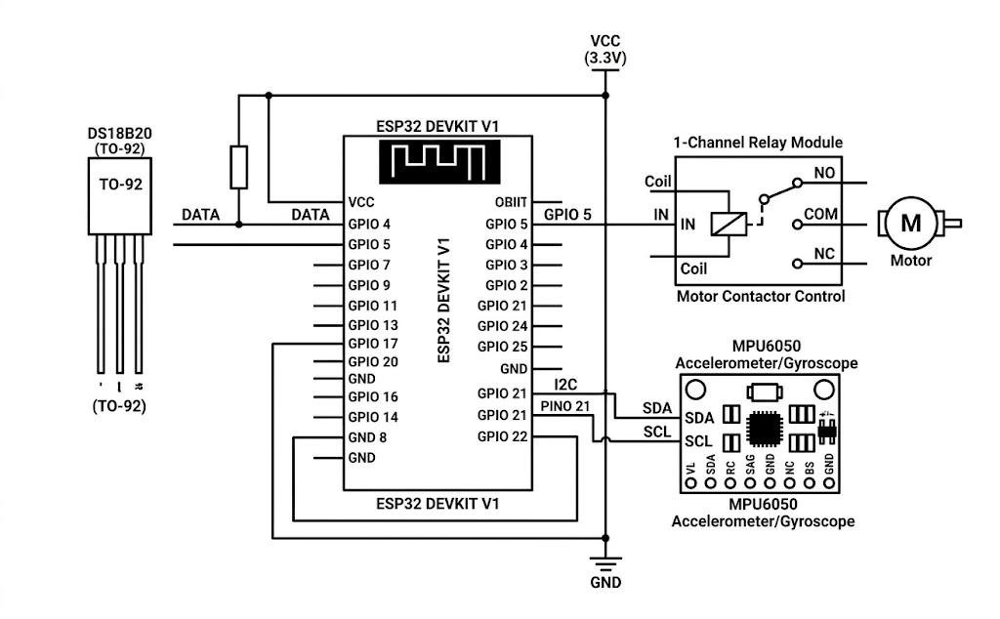
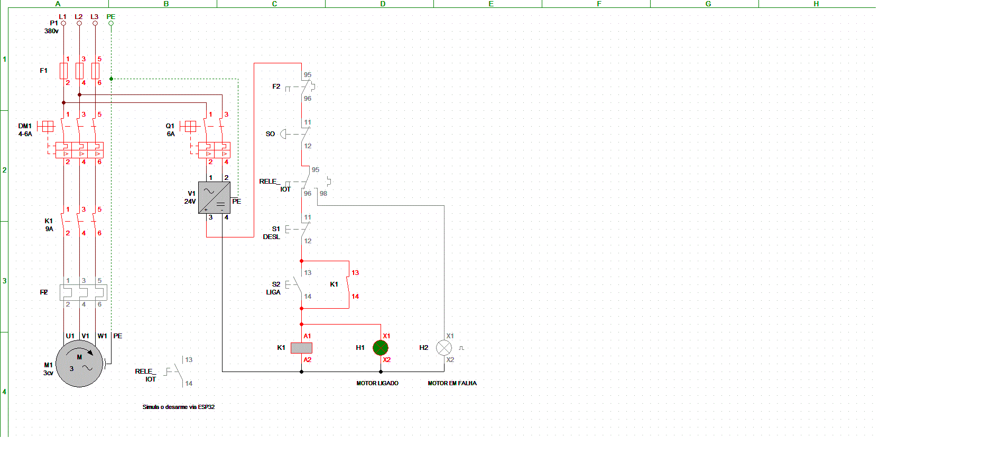
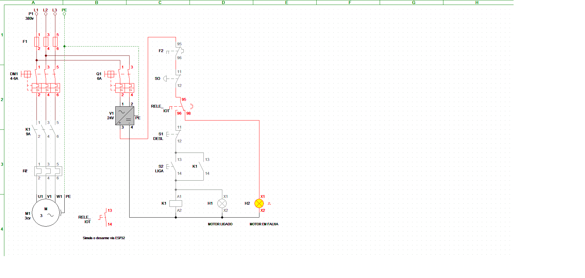

# ⚡ Sistema IoT para Proteção Preditiva e Diagnóstico de Motores Elétricos

> **Protótipo funcional de monitoramento de ativos industriais utilizando ESP32, MQTT e telemetria na nuvem.**

---

## 📌 Visão Geral do Projeto

Falhas em motores trifásicos devido a sobreaquecimento no enrolamento ou vibração excessiva nos rolamentos geram altos custos de parada não planejada. Este projeto integra a **infraestrutura elétrica de comando** com **IoT (Internet das Coisas)** para monitorar em tempo real a integridade do motor e efetuar o **desarme automático do contator** em casos de anomalia.

### 🛠️ Diferenciais da Solução:
- **Proteção Ativa:** Interrupção do circuito de comando do motor em milissegundos via Módulo Relé.
- **Telemetria em Nuvem:** Envio constante de métricas via protocolo MQTT para dashboard supervisório.
- **Manutenção Preditiva:** Identificação antecipada de desgaste em rolamentos por meio de medição de vibração tridimensional.

---

## 🏗️ Arquitetura do Sistema e Hardware

| Componente | Função Elétrica/IoT |
| :--- | :--- |
| **ESP32** | Microcontrolador central com conectividade Wi-Fi e processamento de lógica |
| **DS18B20** | Sensor de temperatura digital blindado (Monitoramento do Enrolamento/Carcaça) |
| **MPU6050** | Acelerômetro e Giroscópio 6-eixos (Monitoramento de Vibração) |
| **Módulo Relé (1 Canal)** | Atuação direta na bobina do contator (Comando de Interrupção) |

---

## 🌐 Telemetria e Dashboard Supervisório

O firmware estabelece conexão segura via **MQTT** com a plataforma **Adafruit IO**, atualizando periodicamente os dados de telemetria:

- **Feed `temperatura`:** Limite crítico configurado em $70^\circ\text{C}$.
- **Feed `vibracao`:** Leitura vetorial RMS com limite crítico em $15.0 \text{ m/s}^2$.
- **Feed `status-falha`:** Signal digital (`0` = Operação Normal, `1` = Motor Desarmado).

---

## 🚀 Teste e Simulação Interativa

Você pode testar e interagir com este projeto diretamente pelo seu navegador através do simulador Wokwi:

👉 **[Acessar Simulação Interativa no Wokwi](https://wokwi.com/projects/472917469255290881)**

---

## 📐 Diagramas e Arquitetura

### Arquitetura do Sistema

### Esquemático do Circuito (ESP32)

### Fluxo de Funcionamento
1. O **ESP32** realiza a leitura dos sensores **DS18B20** e **MPU6050**.
2. Se a temperatura ou a vibração ultrapassarem o limite seguro, o **Relé (GPIO 5)** é acionado para desligar o motor.
3. As métricas e o status de operação são enviados via **MQTT** para o **Adafruit IO**.

## 👨‍💻 Autor

**Raphael Alves Ferreira**  
*Transição de Carreira: Eletricista de Infraestrutura → Desenvolvedor / Engenheiro IoT*  
- [GitHub](https://github.com/rapha0311)
